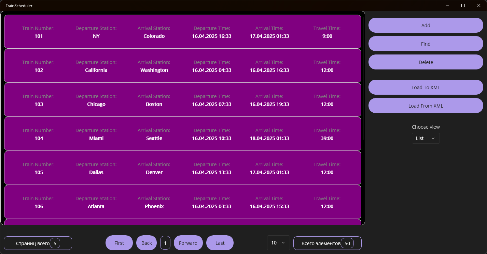
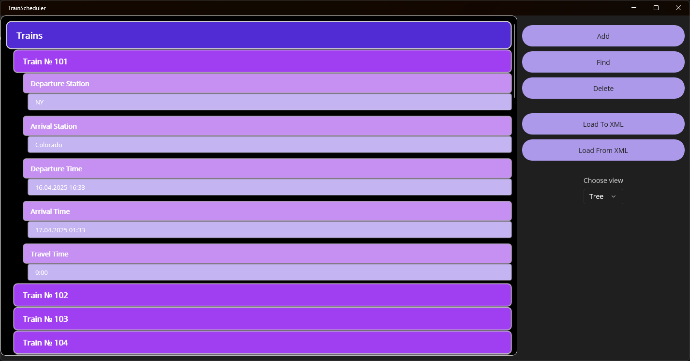
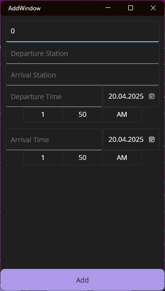
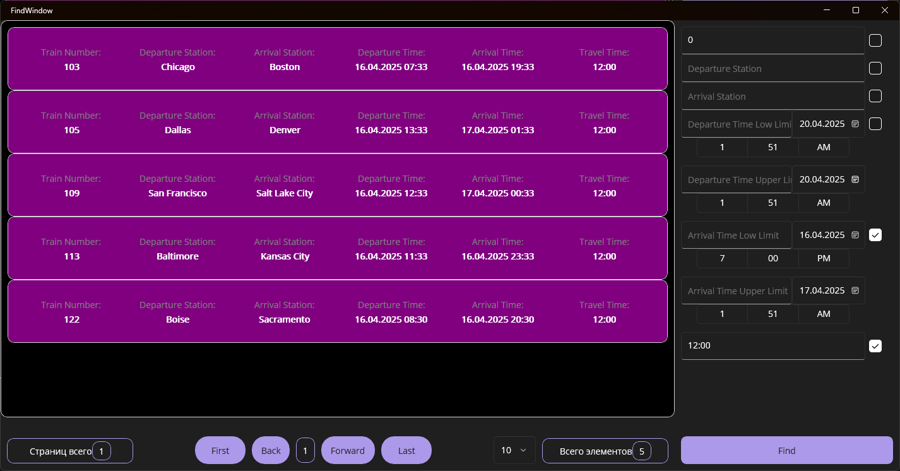
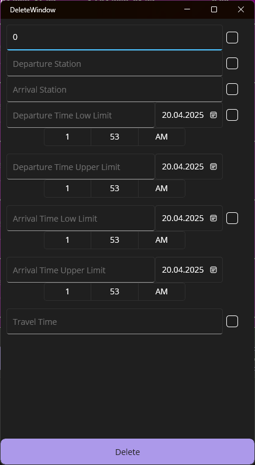
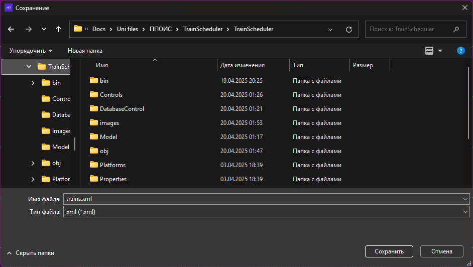

# TrainScheduler

- Фреймворк: .NET MAUI

- Архитектура: MVVM с помощью CommunityToolkit.MVVM

- База данных: SQLite через Entity Framework Core

TrainsScheduler - это оконное приложение с возможностями добавления, удаления и хранения записей о рейсах поездов с использованием базы данных и сериализации в XML формат.

---

### Структура проекта

- `Controls/` — пользовательские элементы управления (кастомные контролы для интерфейса).
- `DatabaseControl/` — взаимодействие с базой данных.
- `Model/` — модели данных, описывающие структуру поезда и списка поездов.
- `Utilities/` — вспомогательные классы: парсеры, поисковики и конвертеры.
- `View/` — визуальные окна приложения: главное окно, окно добавления, удаления, поиска.
- `ViewModel/` — логика приложения, реализованная через MVVM-подход.

---

### Возможности

#### Просмотр записей в постраничном виде

---

#### Просмотр записей в древовидном формте

---

#### Добавление записей в отдельном окне

---

#### Поиск записей в отдельном окне с гибким фильтром

---

#### Удаление записей в отдельном окне

---

#### Загрузка и сохранение записей в xml формате с указанием местоположения

---